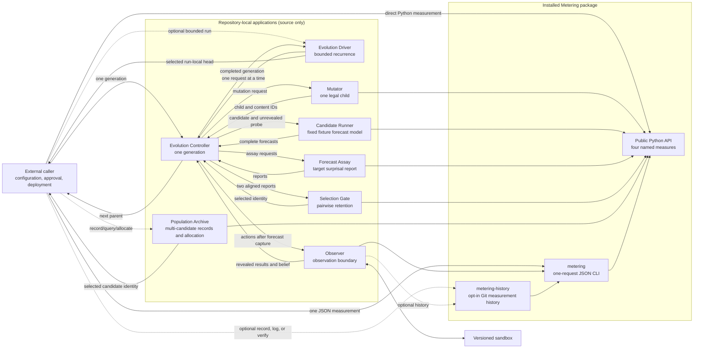

# Metering

Metering is a small, deterministic tool for measuring information in finite
discrete probability distributions.

It implements four named measures:

- self-information;
- Shannon entropy;
- Kullback-Leibler divergence;
- mutual information.

That is the entire measurement surface. Metering does not run agents, choose
actions, estimate probabilities, update beliefs, generate harnesses, train
weights, or interpret meaning. The caller supplies the probability model;
Metering validates it and returns a number. Separate source-only applications
can bind, execute, compare, retain, and record externally produced candidates
without changing that surface.

[`PLAN.md`](PLAN.md) is the normative contract. The
[current capability map](docs/capabilities.md) gives users and coding agents a
short implemented/not-implemented boundary. The
[documentation index](docs/README.md) links the measurement theory, history
format, application composition boundary, and app-local protocols.
The [system foundations](docs/foundations.md) state the equations, biological
analogy, design reasoning, hypotheses, falsifiers, and primary research sources
behind the complete composition.

## System at a glance



Solid arrows show explicit calls or returned data. Dashed arrows are opt-in
measurement recording. Controller owns one generation. The optional source-only
Evolution Driver repeats completed agent-artifact generations under explicit
limits; the caller still owns configuration, final evaluation, installation,
and deployment. The separate Population Archive records caller-supplied
candidate and development-run evidence, maintains a bounded Pareto archive, and
returns one exact parent allocation without executing it. Its SQLite database is
a disposable ledger-derived index. Metering only validates caller-supplied
probability models and evaluates named measures. The Evolution Driver
[README](apps/evolution_driver/README.md) includes a constructed live-Pi
acceptance command that keeps its final cases outside retention and states the
narrow evidence it can establish. The external
[Git artifact bridge](artifacts/git/README.md) uses the same six-stage loop to
select immutable source commits and hash-addressed model-output receipts without
putting environment or trainer policy into Metering.

## Install

Metering requires Python 3.11 or newer and has no Python runtime dependencies.
The optional `metering-history` command additionally requires a `git`
executable. From a checkout with [`uv`](https://docs.astral.sh/uv/):

```bash
uv sync --extra test
```

## Python API

```python
from metering import entropy, kl_divergence, mutual_information, self_information

print(self_information(0.125))
print(entropy([0.5, 0.5]))
print(kl_divergence([0.5, 0.5], [0.75, 0.25]))
print(mutual_information([[0.5, 0.0], [0.0, 0.5]]))
```

```text
3.0
1.0
0.2075187496394219
1.0
```

Base 2 is the default, so these values are bits. Pass `base=math.e` for nats or
another real value that converts to a finite float greater than one.

Inputs must already be normalized probability distributions. Metering rejects
bad input instead of guessing what the caller intended:

```python
from metering import ProbabilityError, entropy

try:
    entropy([1, 1, 2])
except ProbabilityError as error:
    print(error)
```

It does not silently turn counts into probabilities.

## Agent and shell tool

The `metering` command is a strict JSON filter. This is the integration point
for other agents: JSON goes in through standard input and JSON comes out through
standard output.

```bash
printf '%s\n' '{"measure":"entropy","probabilities":[0.5,0.5]}' \
  | uv run metering
```

```json
{"base":2.0,"infinite":false,"measure":"entropy","value":1.0}
```

The four request forms are:

```jsonl
{"measure":"self_information","probability":0.125}
{"measure":"entropy","probabilities":[0.5,0.5]}
{"measure":"kl_divergence","p":[0.5,0.5],"q":[0.75,0.25]}
{"measure":"mutual_information","joint":[[0.5,0.0],[0.0,0.5]]}
```

Add `"base":2` to any request to set the logarithm base explicitly.

Successful responses always contain exactly `base`, `infinite`, `measure`, and
`value`. Since JSON has no legal infinity number, an infinite mathematical
result uses `"infinite":true` and `"value":null`:

```bash
printf '%s\n' '{"measure":"self_information","probability":0}' \
  | uv run metering
```

```json
{"base":2.0,"infinite":true,"measure":"self_information","value":null}
```

Bad JSON, command-line arguments, unknown or extra keys, duplicate keys,
invalid bases, and invalid probability models exit with status 2 and emit one
JSON error on standard error:

```json
{"error":{"code":"invalid_probability","message":"probabilities must sum to 1 within 1e-12; got 2"}}
```

The object has exactly `error.code` and `error.message`. The code is
`invalid_request` for JSON, command-line, or envelope errors and
`invalid_probability` for a rejected probability model or base. The only
options are `-h`/`--help` and `--version`; abbreviations are rejected.

The command handles one request per process. It does not access application
files, call a network service, load a model, or choose which measure to run.

## Agent harness connectors

[`connectors/`](connectors/README.md) contains concrete source-only integrations
for Pi and Prime Agent plus one shared Agent Skills-compatible Metering tool.
From an agent's perspective Metering can be an internal shell or Python tool;
from Metering's trust boundary the agent remains an external proposer or runner
without evaluator or retention authority.

The fixed connectors translate the existing strict proposer and runner JSON
protocols. They do not add either harness, a provider SDK, or model dependency to
the installed package. The former Pi adapter paths under `apps/` and
`artifacts/git/` remain thin compatibility launchers.

Run the explicit live conformance path with a model available to both installed
harnesses:

```bash
uv run python connectors/live_agent_acceptance.py --model llamacpp/local
```

It launches the real `pi` and `prime-agent` commands, requires each model to call
the public Metering JSON boundary through its native tool, and verifies the
result. It performs model inference and is not part of deterministic CI. See the
[connector contract](connectors/README.md) for pinning and pytest invocation.

## Versioned measurement history

`metering-history` is the explicit Git-backed filesystem boundary. It wraps the
ordinary `metering` command and commits only successful configurations and exact
named results:

```bash
history_dir="$(mktemp -d)"
printf '%s\n' '{"measure":"entropy","probabilities":[0.5,0.5]}' \
  | uv run metering-history record "$history_dir"
```

The first record initializes a dedicated Git repository. Its tracked worktree is
only:

```text
measurement/pair/configuration.json
measurement/pair/result.json
measurement/provenance.json
```

The schema-version-2 response uses the pair tree ID as `pair_id`, the Git commit
as `record_id`, its first parent as `parent_record_id`, and the complete Git tree
as `tree_id`. Provenance records the package and Python versions, actual
implementation-file SHA-256, and source state without copying Metering code into
the history.

Inspect newest-first history or verify Git integrity and replay every committed
measurement:

```bash
uv run metering-history log "$history_dir"
uv run metering-history verify "$history_dir"
```

`verify` rejects dirty files, malformed or noncanonical snapshots, merge commits,
Git object corruption, and committed results that differ from current Metering
replay. Git supplies storage, diffs, checkout, and optional remotes; it does not
authenticate the author or prevent an authorized history rewrite. The wrapper
requires a `git` executable but adds no Python dependency.

Interrupted writes can leave `.git/metering-history.lock` or a dirty worktree;
inspect both before cleanup. Legacy schema-version-1 `objects/` histories require
the historical implementation and are not modified automatically. See the
[measurement-history contract](docs/history.md) for the exact schema, repository
layout, verification behavior, and limitations.

## Example application: observer

[`apps/observer`](apps/observer) is a small application that
demonstrates Metering as a subprocess tool. Four immutable fixture directories
represent versions of one sandbox. The observer starts with a uniform
distribution over those versions, predicts the possible results of listing or
reading the sandbox, and asks Metering to measure each result distribution.

Run the deterministic demonstration with:

```bash
uv run python apps/observer/observer.py --active v3
```

Add `--history PATH` to append every Metering call made by the observer to one
measurement history. Without the flag, the observer creates no persistent
state.

For an external agent, start a persistent version 1 JSONL session:

```bash
uv run python apps/observer/observer.py --jsonl --active v3
```

The process accepts one strict `state`, `observe`, or `finish` action per input
line and flushes one response per line. The agent chooses observations while
Observer owns the private sandbox, belief update, and final tree verification.
Recoverable action errors leave the session alive.

The default demonstration chooses the observation with the greatest result entropy,
observes the materialized sandbox, filters the candidate versions itself, and
repeats until one version remains. It prints canonical JSON Lines containing
the explicit probability requests and Metering responses. Before emitting an
identified snapshot, it verifies that the canonical sandbox regular-file
manifest matches that snapshot's `tree_id`. An extra, missing, renamed, or
byte-changed regular file fails explicitly; empty directories and filesystem
metadata are outside this identity.

The version fixtures, inference rule, snapshot hashes, action choice, and loop
belong to the application. None of them is part of the `metering` package. The
reported bits describe the application's declared finite model; they do not
measure the meaning or usefulness of the files.

## Example application: forecast assay

[`apps/forecast_assay`](apps/forecast_assay) is a small agent-facing screening assay,
not an autonomous evolution system. An agent supplies opaque candidate,
evaluation, observation, and target identifiers plus the probability that the
candidate assigned to each target before reveal. The adapter uses Metering's
public `self_information` function to measure those outcomes.

Run the deterministic example with:

```bash
printf '%s\n' \
  '{"schema_version":1,"candidate":"forecast-17","evaluation":"weather-station-a/holdout-v1","observations":[{"observation":"day-001","target":"rain","target_probability":0.5},{"observation":"day-002","target":"rain","target_probability":0.25},{"observation":"day-003","target":"dry","target_probability":1.0}]}' \
  | uv run python apps/forecast_assay/forecast_assay.py
```

Use `--jsonl` to send multiple independent candidate requests through one
process, one request and response per line. Bad lines return aligned error
responses and do not terminate the stream; no candidate state is retained.

Version 1 requests and successful reports carry `"schema_version":1`. The
adapter reports every target surprisal and their explicitly named arithmetic
mean while echoing the identities needed to compare candidates on
the same declared cases. The app itself is the assay in a
directed-evolution-inspired external loop. It does not create mutations,
reproduce candidates, or select them. It contains no neural
architecture, mutation logic, loop, memory, or stopping rule. See the
[biological and mathematical foundations](apps/forecast_assay/docs/foundations.md)
for the exact analogy, logarithmic-loss theory, and falsifiable held-out claim.

## Example application: mutator

[`apps/mutator`](apps/mutator) applies one caller-declared, legal one-locus
change to an immutable parent genome. The request supplies the complete finite
mutation distribution and the draw, so the process has no hidden randomness.
It reports mutation-distribution entropy and selected-mutation surprisal without
claiming that the child is better.

```bash
printf '%s\n' \
  '{"schema_version":1,"catalogue":{"loci":[{"locus":"mode","alleles":["safe","fast"]}]},"parent_genome":{"mode":"safe"},"mutation_distribution":[{"locus":"mode","allele":"fast","probability":1}],"draw":0}' \
  | uv run python apps/mutator/mutator.py
```

## Example application: selection gate

[`apps/selection_gate`](apps/selection_gate) verifies two complete Forecast
Assay reports on identical evidence, recomputes their measurements, and returns
one deterministic pairwise retention decision. It promotes the challenger only
when the finite mean-surprisal improvement strictly exceeds the declared
threshold; conservative rules cover infinite reports.

The gate treats report candidate fields as opaque labels. A controller composing
it with Mutator must set those fields to the exact Mutator parent and child
`candidate_id` values and preserve the mapping to the candidates it actually
executed. See the [Selection Gate command example](apps/selection_gate/README.md)
and the [evolution-kernel boundary](docs/evolution-kernel.md).

## Example applications: candidate runner and controller

[`apps/candidate_runner`](apps/candidate_runner) gives one narrow Mutator genome
an executable probability model over Observer's four fixtures. It verifies the
Mutator content ID, receives no active version, and returns one complete
normalized forecast for an unrevealed probe.

[`apps/controller`](apps/controller) invokes every application through its JSON
standard-stream protocol. It captures both candidate forecasts before each
Observer reveal, creates aligned Forecast Assay reports, asks Selection Gate for
a decision, and returns the selected genome as `next_parent`.

Run the complete generation with:

```bash
uv run python apps/controller/controller.py \
  < apps/controller/example-request.json \
  > /tmp/metering-generation.json
```

This is one deterministic generation, not an autonomous loop. The caller still
owns later requests, mutation-policy changes, budgets, persistence, and
stopping. See the [controller contract](apps/controller/README.md) and complete
integration tests in [`tests/test_controller.py`](tests/test_controller.py).

[`apps/README.md`](apps/README.md) indexes the six repository-local stages plus
the optional Evolution Driver and Population Archive outer controls. None
extends the installed Metering API.

## Agent-artifact generation

Application schema version 2 composes the same six boundaries around any
compatible external agent command. It supports a content-identified default agent,
UTF-8 Agent Skills directory, or immutable Git source/output descriptor;
caller-selected runner and trusted evaluator commands; matched finite task
cases; explicit pass and safety evidence;
committed pre-evaluation forecasts, and one selected `next_parent`.

Run the deterministic protocol demonstration:

```bash
uv run python apps/controller/controller.py \
  < apps/controller/agent-skill-example-request.json
```

The example request uses deterministic demo adapters that inspect skill text;
it does not call a model. Checked-in fixed Pi and Prime Agent runners and skill
proposers are concrete model integrations under `connectors/fixed/`; other
agents and tool-enabled coding runners can implement the same external protocol.
Default/skill adapters receive
a temporary skill path and public task document. Git adapters receive the
normalized commit/tree/output descriptor. Both return a JSON submission plus a
normalized outcome forecast. Adapter JSON is strict: strings used by the
protocol must be valid UTF-8, and decimal conversion may not turn a nonzero
probability into zero or a value distinct from one into one. A separate
trusted evaluator owns hidden checks and returns `passed`, `safety_passed`, and
evidence for both candidates. Forecast Assay measures the committed forecast,
while Selection Gate selects on the declared task and safety policy rather than
mistaking calibration for capability.

Adapters run with the current user's permissions. They own sandboxing, model
and tool configuration, resource budgets, hidden-test isolation, and task
semantics. Controller performs no automatic iteration or skill installation.
For a bounded deterministic recurrence:

```bash
rm -f /tmp/metering-self-evolve.jsonl /tmp/metering-self-evolve.jsonl.lock
uv run python apps/evolution_driver/evolver.py \
  --state /tmp/metering-self-evolve.jsonl \
  < apps/evolution_driver/example-request.json
```

The driver proposes one complete skill or Git candidate, invokes Controller,
records only completed generations, resumes verified state, and stops at
declared limits. It does not install its selected head. A pinned live Pi connector can exercise Git adapter source plus a
hash-addressed model-output receipt with:

```bash
uv run python artifacts/git/demo.py --root /tmp/metering-git-live-$(date +%s)
```

See the complete [agent-artifact evolution protocol](docs/agent-evolution.md)
and [Git bridge contract](artifacts/git/README.md).

## Deterministic population archive

[`apps/population`](apps/population/README.md) is an optional source-only outer
control plane for multiple candidate identities. It keeps a canonical
hash-linked ledger of candidates, experiments, unique replicate runs, named
evidence, development-only Pareto archives, exact uniform parent allocations,
and typed skill-file recombination receipts.

It does not run the allocated parent or replace Controller. A caller may feed
that identity into a later explicit proposal/generation workflow. Final-role
experiments cannot create an archive, their first run seals later search
transitions, and no weighted generic fitness score is computed.

The local SQLite index is disposable and never controls selection:

```bash
uv run python apps/population/population.py rebuild /tmp/metering-population
uv run python apps/population/population.py verify-index /tmp/metering-population
```

See the [Population Archive contract](apps/population/README.md) for strict
initialization, evidence, archive, allocation, recombination, and query request
schemas.

## Definitions and edge cases

For logarithm base `b > 1`:

```text
self-information:      -log_b(p)
entropy:                -sum p_i log_b(p_i)
KL divergence:           sum p_i log_b(p_i / q_i)
mutual information:      sum p(x,y) log_b(p(x,y) / (p(x)p(y)))
```

- `0 log 0` contributes zero.
- Self-information at probability zero is positive infinity.
- KL divergence is positive infinity when `p_i > 0` and `q_i = 0`.
- Distributions must sum to one within an absolute tolerance of `1e-12`.
- Booleans, negative values, values above one, NaN, and infinity are rejected.
- Inputs are converted to double precision; conversion may not collapse a
  nonzero probability to zero or a value distinct from one to one.
- Joint distributions must be rectangular.
- If a joint's total mass is accepted within tolerance as `S`, its independent
  comparison uses `row * column / S`; the supplied cells are not rescaled.
- KL inputs must have equal lengths and matching positional meaning.

Metering does not renormalize accepted values. It uses double-precision
floating-point arithmetic; compare nontrivial results with an appropriate
numerical tolerance.

## What is deliberately absent from the package

There is no world, policy, controller, optimizer, benchmark, model adapter,
MCP server, HTTP service, general trace/report system, general replay engine,
overall score, or information-gain guess. The optional Git measurement history
stores only accepted configurations, named results, and provenance; its replay
check is limited to verifying those four measurements.

The supported measurement scope is finite discrete distributions. Continuous
entropy and estimators from samples need modeling decisions and are not
silently bundled into this package.

## Development

```bash
uv run --extra lint ruff check src apps connectors artifacts tests
uv run --extra test pytest -q
uv build
```

## Compatibility

Application schema version 2 remains additive to the source-only applications;
its direct-challenger request is unchanged and the proposer form is additional.
The Evolution Driver and Population Archive each have separate source-only
schema version 1 state formats. Population SQLite state is rebuildable and has
no migration authority. Schema version 1 fixture requests remain supported.
None of these application boundaries changes Metering's Python API, installed
commands, JSON measurement protocol, history format, or numerical semantics.

The current design is a deliberate breaking replacement of the earlier
hidden-fault harness. Old policies, commands, manifests, traces, reports, and
run directories require the historical checkout that produced them. The new
package does not carry a compatibility layer.
