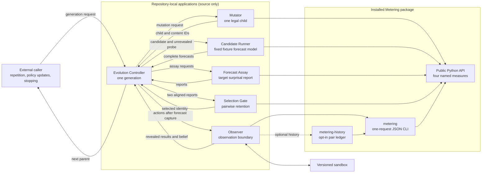

# Metering

Metering is a small, deterministic tool for measuring information in finite
discrete probability distributions.

It implements four named measures:

- self-information;
- Shannon entropy;
- Kullback-Leibler divergence;
- mutual information.

That is the entire measurement surface. Metering does not run agents, choose
actions, estimate probabilities, update beliefs, rank systems, or interpret
meaning. The caller supplies the probability model; Metering validates it and
returns a number. A separate opt-in command can retain accepted measurement
request/response pairs without changing that surface.

[`PLAN.md`](PLAN.md) is the normative contract. The
[documentation index](docs/README.md) links the measurement theory, history
format, application composition boundary, and app-local protocols.

## System at a glance



Solid arrows show explicit calls or returned data. Dashed arrows are opt-in
measurement recording. The repository controller owns one generation; the
external caller still owns repetition and every policy update. Metering only
validates caller-supplied probability models and evaluates named measures.

## Install

Metering requires Python 3.11 or newer and has no runtime dependencies. From a
checkout with [`uv`](https://docs.astral.sh/uv/):

```bash
uv sync --extra test
```

## Python API

```python
from metering import entropy, kl_divergence, mutual_information, self_information

print(self_information(0.125))
print(entropy([0.5, 0.5]))
print(kl_divergence([0.5, 0.5], [0.75, 0.25]))
print(mutual_information([[0.5, 0.0], [0.0, 0.5]]))
```

```text
3.0
1.0
0.2075187496394219
1.0
```

Base 2 is the default, so these values are bits. Pass `base=math.e` for nats or
another real value that converts to a finite float greater than one.

Inputs must already be normalized probability distributions. Metering rejects
bad input instead of guessing what the caller intended:

```python
from metering import ProbabilityError, entropy

try:
    entropy([1, 1, 2])
except ProbabilityError as error:
    print(error)
```

It does not silently turn counts into probabilities.

## Agent and shell tool

The `metering` command is a strict JSON filter. This is the integration point
for other agents: JSON goes in through standard input and JSON comes out through
standard output.

```bash
printf '%s\n' '{"measure":"entropy","probabilities":[0.5,0.5]}' \
  | uv run metering
```

```json
{"base":2.0,"infinite":false,"measure":"entropy","value":1.0}
```

The four request forms are:

```jsonl
{"measure":"self_information","probability":0.125}
{"measure":"entropy","probabilities":[0.5,0.5]}
{"measure":"kl_divergence","p":[0.5,0.5],"q":[0.75,0.25]}
{"measure":"mutual_information","joint":[[0.5,0.0],[0.0,0.5]]}
```

Add `"base":2` to any request to set the logarithm base explicitly.

Successful responses always contain exactly `base`, `infinite`, `measure`, and
`value`. Since JSON has no legal infinity number, an infinite mathematical
result uses `"infinite":true` and `"value":null`:

```bash
printf '%s\n' '{"measure":"self_information","probability":0}' \
  | uv run metering
```

```json
{"base":2.0,"infinite":true,"measure":"self_information","value":null}
```

Bad JSON, command-line arguments, unknown or extra keys, duplicate keys,
invalid bases, and invalid probability models exit with status 2 and emit one
JSON error on standard error:

```json
{"error":{"code":"invalid_probability","message":"probabilities must sum to 1 within 1e-12; got 2"}}
```

The object has exactly `error.code` and `error.message`. The code is
`invalid_request` for JSON, command-line, or envelope errors and
`invalid_probability` for a rejected probability model or base. The only
options are `-h`/`--help` and `--version`; abbreviations are rejected.

The command handles one request per process. It does not access application
files, call a network service, load a model, or choose which measure to run.

## Versioned measurement history

`metering-history` is the explicit filesystem-writing boundary. It wraps the
ordinary `metering` command and appends only successful request/response pairs:

```bash
history_dir="$(mktemp -d)"
printf '%s\n' '{"measure":"entropy","probabilities":[0.5,0.5]}' \
  | uv run metering-history record "$history_dir"
```

The result contains schema version 1, the normalized request, exact Metering
response, package version, `pair_id`, `parent_record_id`, and `record_id`. The
pair ID identifies the request/response content. The record ID is the hash of
the complete stored record and also binds that pair to its parent, so repeated
pairs at different positions remain distinct history records.

Inspect newest-first history or check its structural integrity with:

```bash
uv run metering-history log "$history_dir"
uv run metering-history verify "$history_dir"
```

The directory contains an immutable object per record and a `HEAD` pointer.
Writes are serialized with a `LOCK` directory and update `HEAD` atomically. An
invalid Metering request does not create or advance the history. A process killed
during a write may leave a stale `LOCK`; inspect the directory before removing
that lock.

Storage, command, and integrity failures are explicit canonical JSON errors with
exit status 2. See the [measurement-history contract](docs/history.md) for exact
response schemas, file layout, identity formulas, validation, and limitations.

This is deliberately smaller than Git. It is one local linear lineage, with no
branches, merges, remotes, tags, checkout, signatures, timestamps, or automatic
replay. `verify` checks canonical encoding, hashes, parent links, and
reachability. Hashes detect modification; they do not authenticate the author or
prove that trusted software created an object.

## Example application: observer

[`apps/observer`](apps/observer) is a small application that
demonstrates Metering as a subprocess tool. Four immutable fixture directories
represent versions of one sandbox. The observer starts with a uniform
distribution over those versions, predicts the possible results of listing or
reading the sandbox, and asks Metering to measure each result distribution.

Run the deterministic demonstration with:

```bash
uv run python apps/observer/observer.py --active v3
```

Add `--history PATH` to append every Metering call made by the observer to one
measurement history. Without the flag, the observer creates no persistent
state.

For an external agent, start a persistent version 1 JSONL session:

```bash
uv run python apps/observer/observer.py --jsonl --active v3
```

The process accepts one strict `state`, `observe`, or `finish` action per input
line and flushes one response per line. The agent chooses observations while
Observer owns the private sandbox, belief update, and final tree verification.
Recoverable action errors leave the session alive.

The default demonstration chooses the observation with the greatest result entropy,
observes the materialized sandbox, filters the candidate versions itself, and
repeats until one version remains. It prints canonical JSON Lines containing
the explicit probability requests and Metering responses. Before emitting an
identified snapshot, it verifies that the canonical sandbox file manifest
matches that snapshot's `tree_id`; out-of-model content fails explicitly.

The version fixtures, inference rule, snapshot hashes, action choice, and loop
belong to the application. None of them is part of the `metering` package. The
reported bits describe the application's declared finite model; they do not
measure the meaning or usefulness of the files.

## Example application: forecast assay

[`apps/forecast_assay`](apps/forecast_assay) is a small agent-facing screening assay,
not an autonomous evolution system. An agent supplies opaque candidate,
evaluation, observation, and target identifiers plus the probability that the
candidate assigned to each target before reveal. The adapter uses Metering's
public `self_information` function to measure those outcomes.

Run the deterministic example with:

```bash
printf '%s\n' \
  '{"schema_version":1,"candidate":"forecast-17","evaluation":"weather-station-a/holdout-v1","observations":[{"observation":"day-001","target":"rain","target_probability":0.5},{"observation":"day-002","target":"rain","target_probability":0.25},{"observation":"day-003","target":"dry","target_probability":1.0}]}' \
  | uv run python apps/forecast_assay/forecast_assay.py
```

Use `--jsonl` to send multiple independent candidate requests through one
process, one request and response per line. Bad lines return aligned error
responses and do not terminate the stream; no candidate state is retained.

Version 1 requests and successful reports carry `"schema_version":1`. The
adapter reports every target surprisal and their explicitly named arithmetic
mean while echoing the identities needed to compare candidates on
the same declared cases. The app itself is the assay in a
directed-evolution-inspired external loop. It does not create mutations,
reproduce candidates, or select them. It contains no neural
architecture, mutation logic, loop, memory, or stopping rule. See the
[biological and mathematical foundations](apps/forecast_assay/docs/foundations.md)
for the exact analogy, logarithmic-loss theory, and falsifiable held-out claim.

## Example application: mutator

[`apps/mutator`](apps/mutator) applies one caller-declared, legal one-locus
change to an immutable parent genome. The request supplies the complete finite
mutation distribution and the draw, so the process has no hidden randomness.
It reports mutation-distribution entropy and selected-mutation surprisal without
claiming that the child is better.

```bash
printf '%s\n' \
  '{"schema_version":1,"catalogue":{"loci":[{"locus":"mode","alleles":["safe","fast"]}]},"parent_genome":{"mode":"safe"},"mutation_distribution":[{"locus":"mode","allele":"fast","probability":1}],"draw":0}' \
  | uv run python apps/mutator/mutator.py
```

## Example application: selection gate

[`apps/selection_gate`](apps/selection_gate) verifies two complete Forecast
Assay reports on identical evidence, recomputes their measurements, and returns
one deterministic pairwise retention decision. It promotes the challenger only
when the finite mean-surprisal improvement strictly exceeds the declared
threshold; conservative rules cover infinite reports.

The gate treats report candidate fields as opaque labels. A controller composing
it with Mutator must set those fields to the exact Mutator parent and child
`candidate_id` values and preserve the mapping to the candidates it actually
executed. See the [Selection Gate command example](apps/selection_gate/README.md)
and the [evolution-kernel boundary](docs/evolution-kernel.md).

## Example applications: candidate runner and controller

[`apps/candidate_runner`](apps/candidate_runner) gives one narrow Mutator genome
an executable probability model over Observer's four fixtures. It verifies the
Mutator content ID, receives no active version, and returns one complete
normalized forecast for an unrevealed probe.

[`apps/controller`](apps/controller) invokes every application through its JSON
standard-stream protocol. It captures both candidate forecasts before each
Observer reveal, creates aligned Forecast Assay reports, asks Selection Gate for
a decision, and returns the selected genome as `next_parent`.

Run the complete generation with:

```bash
uv run python apps/controller/controller.py \
  < apps/controller/example-request.json \
  > /tmp/metering-generation.json
```

This is one deterministic generation, not an autonomous loop. The caller still
owns later requests, mutation-policy changes, budgets, persistence, and
stopping. See the [controller contract](apps/controller/README.md) and complete
integration tests in [`tests/test_controller.py`](tests/test_controller.py).

[`apps/README.md`](apps/README.md) indexes all six repository-local applications.
None extends the installed Metering API.

## Definitions and edge cases

For logarithm base `b > 1`:

```text
self-information:      -log_b(p)
entropy:                -sum p_i log_b(p_i)
KL divergence:           sum p_i log_b(p_i / q_i)
mutual information:      sum p(x,y) log_b(p(x,y) / (p(x)p(y)))
```

- `0 log 0` contributes zero.
- Self-information at probability zero is positive infinity.
- KL divergence is positive infinity when `p_i > 0` and `q_i = 0`.
- Distributions must sum to one within an absolute tolerance of `1e-12`.
- Booleans, negative values, values above one, NaN, and infinity are rejected.
- Inputs are converted to double precision; conversion may not collapse a
  nonzero probability to zero or a value distinct from one to one.
- Joint distributions must be rectangular.
- If a joint's total mass is accepted within tolerance as `S`, its independent
  comparison uses `row * column / S`; the supplied cells are not rescaled.
- KL inputs must have equal lengths and matching positional meaning.

Metering does not renormalize accepted values. It uses double-precision
floating-point arithmetic; compare nontrivial results with an appropriate
numerical tolerance.

## What is deliberately absent from the package

There is no world, policy, controller, optimizer, benchmark, model adapter,
MCP server, HTTP service, general trace/report system, replay engine, overall
score, or information-gain guess. The fixed measurement ledger stores only the
accepted JSON pair, package version, and parent-bound identifiers.

The supported measurement scope is finite discrete distributions. Continuous
entropy and estimators from samples need modeling decisions and are not
silently bundled into this package.

## Development

```bash
uv run --extra test pytest -q
uv build
```

## Compatibility

Candidate Runner and Evolution Controller are additive source-only examples.
They do not change Metering's Python API, installed commands, JSON measurement
protocol, history format, or existing application schemas.

The current design is a deliberate breaking replacement of the earlier
hidden-fault harness. Old policies, commands, manifests, traces, reports, and
run directories require the historical checkout that produced them. The new
package does not carry a compatibility layer.
