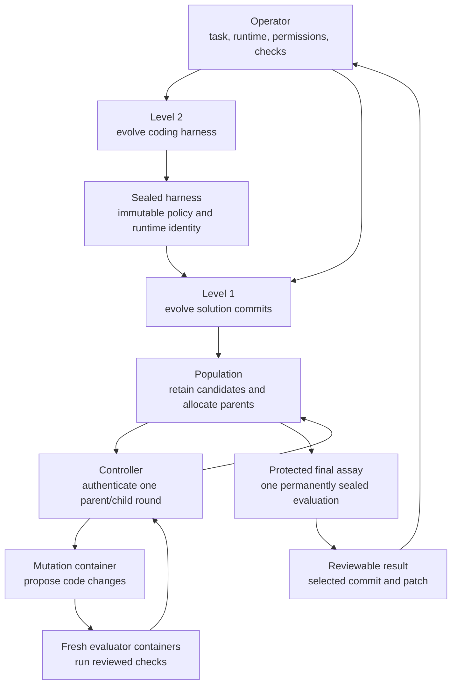

# How the coding agent works

## High-level architecture



The operator owns the task, repository identity, writable paths, checks,
budgets, runtime, and final decision. The model can propose edits but cannot
choose the evaluator, select itself, authorize retry, or deploy the result.

## The two levels

### Level 2: harness evolution

Level 2 evolves the coding policy rather than project code. Each child changes
exactly one of nine typed loci, such as the system prompt, context policy, tool
policy, snapshot policy, dependency lock, or entry point.

Each harness candidate is independently tested on fixed coding workspaces. The
selected harness then runs a protected assay and is sealed as
`selected-harness.json`. Trusted Controller, Population, evaluator, and Docker
security code are not evolvable loci.

### Level 1: solution evolution

Level 1 freezes the selected harness and evolves only repository files under the
operator's allowed paths. The approved base commit is archived into an isolated
container without `.git`. The harness inspects and edits that copy, and fixed
host code validates the returned archive before creating an immutable child
commit.

Harness policy and solution code therefore never change in the same experiment.
This makes evidence attributable to one fixed coding setup.

## One solution round

1. **Allocate a parent.** Population chooses one retained immutable commit using
   a predeclared exact rational draw.
2. **Propose a child.** The frozen harness edits an archive-only workspace in a
   bounded mutation container.
3. **Validate heredity.** Fixed host code checks every path and file, then creates
   a first-parent Git commit. Session and temporary state are discarded.
4. **Evaluate independently.** Parent and child checks run in separate fresh
   containers using operator-approved argv commands.
5. **Authenticate the comparison.** Controller binds candidates, tasks, runtime,
   outputs, resources, and receipts for that one pairwise generation.
6. **Update Population.** Population records named evidence, updates its bounded
   Pareto archive, and allocates the next parent. There is no scalar fitness.

The process repeats only within declared round, proposal-call, wall-time, and
resource limits.

## Finalization

After development stops, fixed code chooses from the development archive by:

1. highest development task rate;
2. highest reliability; and
3. an exact tie draw over canonical candidate IDs.

That allocation is recorded before protected-final content is opened. The
selected commit then runs each protected check in a fresh container. The first
final run permanently seals the experiment whether it passes or fails; final
evidence cannot restart search.

## Security and evidence

```text
Git commits       immutable candidate source and ancestry
JSONL ledgers     recurrence, archive, and selection history
JSON receipts     mutation, execution, resources, and final evidence
SQLite            disposable query index only
status/report     operator-facing projections only
```

Candidate containers have no network, host mounts, host `.git`, Docker socket,
credentials, writable root, or automatic image pull. Mutation and authoritative
evaluation never share a container. These controls do not sandbox ordinary
interactive Pi, which retains the host user's permissions.

A completed result is a verified immutable commit plus `selected.patch`. Nothing
is automatically applied, merged, installed, or deployed.

Next: [operations](operations.md), [task profiles](task-profile.md), or the
[detailed architecture and threat model](architecture.md).
